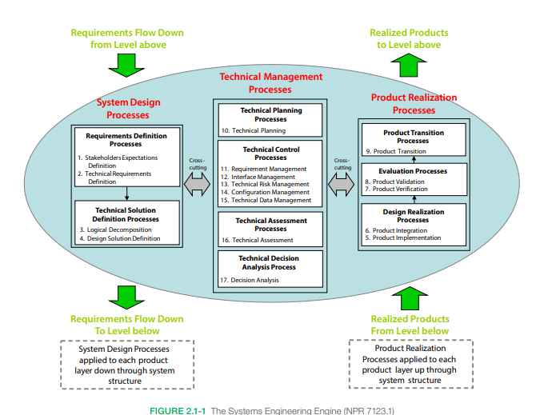
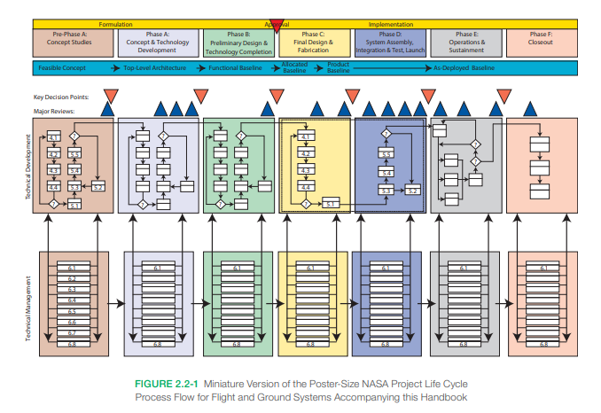
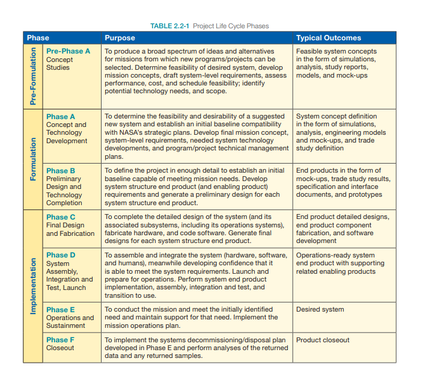

### Fundamentals of Systems Engineering

Na NASA, "engenharia de sistemas" é definida como uma abordagem metódica e multidisciplinar para o projeto, realização, gerenciamento técnico, operações e desativação de um sistema. Um "sistema" é a combinação de elementos que funcionam juntos para produzir a capacidade necessária para atender a uma demanda.

Os elementos incluem todo o hardware, software, equipamentos, instalações, pessoal, processos e procedimentos necessários para esse propósito; ou seja, tudo o que é exigido para gerar resultados em nível de sistema. Esses resultados incluem qualidades, propriedades, características, funções, comportamento e desempenho do sistema.

O valor agregado pelo sistema como um todo, além do que é contribuído independentemente por suas partes, é criado principalmente pelo relacionamento entre essas partes, ou seja, pela forma como estão interconectadas. Trata-se de uma maneira de visualizar o "panorama geral" ao tomar decisões técnicas.

> A engenharia de sistemas busca atender aos requisitos funcionais, físicos e operacionais das partes interessadas dentro do ambiente de uso pretendido, ao longo do ciclo de vida planejado do sistema, considerando custos, prazos e outras restrições. Além disso, é uma metodologia que auxilia na contenção dos custos do ciclo de vida de um sistema. Em outras palavras, engenharia de sistemas é uma forma lógica de pensar.
Gerentes técnicos, engenheiros-chefes ou outros cargos similares podem desempenhar funções relacionadas à engenharia de sistemas, mas, para este documento, o termo "engenheiro de sistemas" será utilizado.

> O papel e as responsabilidades do engenheiro de sistemas podem variar de projeto para projeto, dependendo do tamanho e da complexidade, bem como de fase para fase ao longo do ciclo de vida. Em projetos grandes, pode haver um ou mais engenheiros de sistemas. Já em projetos menores, o próprio gerente do projeto pode assumir essas práticas. No entanto, independentemente de quem assuma essas responsabilidades, as funções da engenharia de sistemas devem ser realizadas.

A designação exata dos papéis e responsabilidades do engenheiro de sistemas pode variar. O engenheiro de sistemas líder garante que o sistema atenda tecnicamente às necessidades e requisitos definidos e que uma abordagem adequada de engenharia de sistemas esteja sendo seguida. Ele supervisiona as atividades de engenharia de sistemas do projeto realizadas pela equipe técnica, dirigindo, comunicando, monitorando e coordenando as tarefas. Além disso, ele revisa e avalia os aspectos técnicos do projeto para garantir que os processos de engenharia de sistemas e subsistemas estejam funcionando corretamente, evoluindo o sistema do conceito ao produto final. Toda a equipe técnica está envolvida no processo de engenharia de sistemas.

O engenheiro de sistemas geralmente desempenha um papel fundamental no desenvolvimento do conceito de operações (ConOps) e na arquitetura do sistema resultante, definindo limites, alocando requisitos, avaliando compromissos de design, equilibrando riscos técnicos entre os sistemas, definindo e avaliando interfaces e supervisionando as atividades de verificação e validação, entre outras tarefas.

Normalmente, o engenheiro de sistemas lidera o planejamento técnico e tem a responsabilidade principal de documentar muitos dos planos técnicos, requisitos e especificações, documentos de verificação e validação, pacotes de certificação e outros registros técnicos.

> Em resumo, o engenheiro de sistemas possui habilidades na arte e ciência de equilibrar interações organizacionais, custos e aspectos técnicos em sistemas complexos. Tanto o engenheiro de sistemas quanto a organização de suporte são essenciais para auxiliar no Planejamento e Controle de Programas e Projetos (PP&C), fornecendo informações precisas e oportunas sobre custos e cronogramas para as atividades técnicas.

A engenharia de sistemas trata de compensações e concessões, adotando uma visão ampla e transversal do sistema, em vez de uma abordagem focada em uma única disciplina. Ela não apenas garante que o projeto esteja correto (atenda aos requisitos), mas também que seja o projeto certo (habilite os objetivos operacionais e atenda às expectativas das partes interessadas).

> A engenharia de sistemas desempenha um papel fundamental na organização do projeto. Gerenciar um projeto envolve três objetivos principais: gerenciar os aspectos técnicos, gerenciar a equipe do projeto e gerenciar custos e cronogramas. Esses três elementos estão interligados.

A engenharia de sistemas foca nas características técnicas das decisões, incluindo aspectos técnicos, custos e cronogramas, fornecendo essas informações ao gerente do projeto. Já a função de Planejamento e Controle de Projetos (PP&C) é responsável por identificar e controlar os custos e prazos do projeto. O gerente de projeto tem a responsabilidade geral de gerenciar a equipe e garantir que o projeto entregue um sistema tecnicamente correto dentro dos custos e prazos estabelecidos.

É importante notar que há áreas de sobreposição entre as duas bases do gerenciamento de projetos: engenharia de sistemas (SE) e Planejamento e Controle de Projetos (PP&C). Nessas áreas, a engenharia de sistemas fornece os aspectos técnicos e as entradas, enquanto o PP&C fornece as informações programáticas, de custo e cronograma.

Este documento foca no lado da engenharia de sistemas do diagrama. As práticas e processos abordados são extraídos do NPR 7123.1, *NASA Systems Engineering Processes and Requirements*. Cada processo é descrito com muito mais detalhes nos capítulos subsequentes.

#### 2.1 Os Processos Técnicos Comuns e o Motor de Engenharia de Sistemas
O documento NPR 7123.1, NASA Systems Engineering Processes and Requirements define três conjuntos de processos técnicos comuns: projeto do sistema, realização do produto e gestão técnica. Esses processos e suas interações são representados pelo "motor" da engenharia de sistemas ilustrado na FIGURA 2.1-1.

Os processos do motor de engenharia de sistemas são aplicados para desenvolver e concretizar os produtos finais. Este capítulo apresenta o contexto de aplicação dos 17 processos técnicos comuns exigidos pelo NPR 7123.1.

- Os processos de projeto do sistema,

- Os processos de realização do produto, e

 - Os processos de gestão técnica

são explorados com mais detalhes nos Capítulos 4.0, 5.0 e 6.0, respectivamente.

Os processos 1 a 9, indicados na FIGURA 2.1-1, representam as tarefas executadas ao longo do projeto. Já os processos 10 a 17 são ferramentas transversais utilizadas para suportar e conduzir esses processos.

expectations.

### **Processos de Projeto do Sistema**
Os quatro processos de projeto do sistema ilustrados na **FIGURA 2.1-1** são utilizados para:

- Definir e estabelecer as expectativas dos stakeholders,
- Gerar e formalizar requisitos técnicos,
- Decompor os requisitos em modelos lógicos e comportamentais, e
- Converter os requisitos técnicos em uma solução de projeto que atenda às expectativas dos stakeholders.

Esses processos são aplicados a **cada produto** dentro da estrutura do sistema, do topo até a base, até que os produtos de menor nível sejam suficientemente definidos para serem **construídos, adquiridos ou reutilizados**. Todos os outros produtos do sistema são concretizados por meio de **implementação ou integração**.

### **Processos de Realização do Produto**
Os processos de realização do produto são aplicados a **cada produto operacional/missional** na estrutura do sistema, começando pelos produtos de nível mais baixo e subindo para produtos integrados de nível superior.

Esses processos são usados para:

- Criar a solução de projeto de cada produto (**compra, desenvolvimento de código, construção ou reutilização**),
- **Verificar e validar** os produtos em cada nível hierárquico, garantindo que satisfaçam seus requisitos de projeto, e
- **Fazer a transição** dos produtos aprovados para o próximo nível da estrutura do sistema.
- **Expectativas dos Stakeholders ao Longo do Ciclo de Vida**: Os produtos devem atender às expectativas dos stakeholders de acordo com a fase aplicável do ciclo de vida do projeto.

### **Processos de Gestão Técnica**
Os processos de gestão técnica são utilizados para:

- **Estabelecer e evoluir os planos técnicos** do projeto,
- **Gerenciar a comunicação** entre interfaces,
- **Avaliar o progresso** em relação aos planos e requisitos dos produtos ou serviços do sistema,
- **Controlar a execução técnica** do projeto até sua conclusão, e
- **Apoiar o processo de tomada de decisão**.

Esses processos garantem que o desenvolvimento do sistema ocorra de maneira eficiente, dentro dos parâmetros técnicos, de custo e de cronograma estabelecidos.

garantir que os produtos resultantes atendam aos requisitos estabelecidos e possam ser validados e verificados em cada fase do ciclo de vida.

Iteratividade: Ocorre quando um processo é reaplicado ao mesmo produto ou conjunto de produtos para corrigir discrepâncias ou variações identificadas em relação aos requisitos.

Recursividade: Refere-se à aplicação repetida dos processos para detalhar os produtos do sistema em níveis inferiores ou integrar produtos em níveis superiores dentro da estrutura do sistema. Isso também inclui a reaplicação dos processos ao longo das fases do ciclo de vida para amadurecer a definição do sistema e garantir o cumprimento dos critérios de sucesso de cada fase.

Dessa forma, os processos técnicos são aplicados de forma contínua para transformar os conceitos iniciais do sistema em informações detalhadas e concretas que permitam à equipe técnica implementar e evoluir os produtos do sistema de maneira eficiente.

O processo de engenharia de sistemas continua até que o produto ou sistema completo tenha sido totalmente integrado, verificado, validado e finalmente transferido para sua fase operacional. Isso garante que cada componente menor seja incorporado em subsistemas maiores de forma estruturada, resultando em um sistema coeso e funcional.

Para uma explicação mais detalhada sobre a aplicação do SE Engine, a NASA disponibiliza o documento *Expanded Guidance for SE*, que pode ser acessado em:
🔗 [NASA Expanded Guidance for SE](https://nen.nasa.gov/web/se/doc-repository).

Além disso, a norma **AS9100** é um sistema de gestão da qualidade amplamente utilizado na indústria aeroespacial comercial. Alguns centros da NASA adotaram essa certificação e podem exigir que seus contratados sigam o **NPR 7123.1**, garantindo alinhamento com os padrões de qualidade e processos da agência.

A **Tabela 2.1-1** do documento relaciona os **17 processos de engenharia de sistemas da NASA** com os requisitos do **AS9100**, demonstrando como os processos da NASA se integram ao sistema de qualidade amplamente reconhecido na indústria aeroespacial.

A **Figura 2.2-1** ilustra conceitualmente como o motor de engenharia de sistemas (SE Engine) é utilizado durante cada fase de um projeto, desde a **Pre-Phase A** até a **Phase F**. Cada fase do ciclo de vida do projeto é detalhada na **Tabela 2.2-1**. A figura apresenta um diagrama conceitual que descreve as atividades, pontos de decisão chave (KDPs) e as revisões principais ao longo de cada fase.

As fases do ciclo de vida do projeto incluem:

- **Pre-Phase A**: Estudos de Conceito
- **Phase A**: Desenvolvimento de Conceito e Tecnologia
- **Phase B**: Projeto Preliminar e Conclusão da Tecnologia
- **Phase C**: Projeto Final e Fabricação
- **Phase D**: Montagem do Sistema, Integração e Teste, Lançamento
- **Phase E**: Operações e Sustentação
- **Phase F**: Fechamento

O gráfico mostra como a maturidade do sistema do projeto evolui de um conceito viável para o sistema implantado, acompanhando as atividades de cada fase, os **Pontos de Decisão Chave (KDPs)** e as revisões de projeto.

A **banda horizontal superior** serve como uma referência para a maturidade do sistema do projeto à medida que ele avança, destacando as atividades da fase, os pontos de decisão e as revisões principais. A **banda horizontal seguinte** mostra o desenvolvimento técnico, detalhando como a engenharia de sistemas é aplicada em cada fase.

Para mais informações detalhadas, o documento fornece um link para a versão do **cartaz** da figura, disponível em:
🔗 [NASA Project Life Cycle Process Flow](https://nen.nasa.gov/web/se/doc-repository).

Os processos técnicos (passos **1 a 9**) são aplicados em cada fase do projeto, e o **motor de engenharia de sistemas (SE Engine)** percorre **cinco ciclos** entre a **Pre-Phase A** e a **Phase D**. Durante essas fases, a **NASA estruturou as Fases C e D** para dividir os processos de desenvolvimento técnico em duas partes, garantindo um controle de gerenciamento mais próximo. Isso é representado por uma **linha tracejada** nessas fases, indicando a separação dos processos.

Após a entrada na **Fase E (Operações e Sustentação)** e na **Fase F (Fechamento)**, o foco do trabalho técnico muda para atividades relacionadas à manutenção, suporte e encerramento do projeto.

Além dos processos técnicos, a **faixa horizontal seguinte** da **Figura 2.2-1** apresenta os **oito processos de gerenciamento técnico** (**passos 10 a 17**) aplicados em cada fase do projeto. O **SE Engine percorre os processos de gerenciamento técnico sete vezes**, desde a **Pre-Phase A** até a **Phase F**, garantindo a evolução contínua do projeto e seu alinhamento com os requisitos e expectativas das partes interessadas.
### Diferenças entre Verificação e Validação de Produto

Embora os processos de **Verificação** e **Validação** possam parecer semelhantes, seus objetivos são distintos:

- **Verificação**: Demonstra que o produto atende aos requisitos definidos, ou seja, comprova que cada especificação obrigatória (**"shall" statement**) foi cumprida. Isso pode ser feito por meio de **testes, análises, inspeções ou demonstrações** (ou uma combinação desses métodos). A verificação está relacionada ao **conjunto de requisitos aprovados** e pode ocorrer em diferentes estágios do ciclo de vida do produto.

- **Validação**: Mostra que o produto atende ao **propósito pretendido** e funciona corretamente no ambiente para o qual foi projetado. A validação assegura que o produto atende às **expectativas do cliente e das partes interessadas**, sendo avaliada por **testes, análises, inspeções ou demonstrações** em condições realistas ou simuladas.

### Importância da Verificação e Validação

- **A verificação** garante que a **linha de base de configuração** do produto está bem definida e documentada (especificações, listas de peças, desenhos técnicos etc.), evitando modificações futuras que possam ser **custosas ou impactar o desempenho**.

- **A validação** está ligada ao **ConOps (Concept of Operations)**, sendo conduzida em **condições realistas** para garantir que o produto seja **eficaz e adequado** para uso operacional. A validação pode ser feita **em cada fase do desenvolvimento** usando modelos, não apenas na entrega do produto final.

Esse processo contínuo de **verificação e validação** é essencial para garantir que o sistema funcione conforme esperado, evitando falhas críticas e reduzindo custos de correção no futuro.

### Considerações sobre Verificação e Validação ao Longo das Fases

Os métodos de **verificação e validação** podem (e devem) **variar entre as fases do projeto**, à medida que o design avança. A **validação precoce** (especialmente nas fases **Pre-Phase A e Phase A**) é crucial, pois ainda é possível realizar **ajustes no design** com um custo reduzido. Quanto mais cedo uma falha ou necessidade de ajuste for identificada, menor será o impacto financeiro e técnico no projeto.

A pergunta-chave durante todo o processo deve ser:
**“Estamos construindo o produto certo para nossos usuários e outras partes interessadas?”**

A escolha do método de **verificação** ou **validação** depende da análise **técnica e do julgamento de engenharia**, considerando a forma mais eficiente de demonstrar que o produto:
 **Atende aos requisitos estabelecidos** (Verificação)
 **Opera conforme esperado no ambiente real** (Validação)

---

### Considerações sobre Custo e Efetividade no Desenvolvimento do Sistema

O principal objetivo da **engenharia de sistemas** é garantir que o sistema seja projetado, construído e operado de maneira **segura e econômica**, equilibrando **desempenho, custo, cronograma e risco**.

Nem sempre há um único design "ótimo". Muitas vezes, diferentes alternativas podem atender ao critério de **custo-benefício**, exigindo **estudos de trade-off** para identificar o melhor compromisso entre **custo e desempenho**.

#### Tipos de Decisões em Estudos de Trade-Off:
- **"Win-Win" (ganha-ganha)**:
  🔹 Reduz o custo sem comprometer o desempenho
  🔹 Aumenta o desempenho sem aumentar o custo
   Fácil de decidir, pois traz benefícios sem perdas

- **Trade-offs difíceis**:
  🔹 Reduzir custos pode comprometer a eficácia
  🔹 Melhorar o desempenho pode aumentar o custo
   Necessário analisar impacto, riscos e viabilidade

A tomada de decisão nesses casos exige **experiência e análise detalhada**, garantindo que o projeto entregue um **sistema eficiente e seguro** dentro das limitações financeiras e operacionais.

### Impacto do Design nos Custos do Ciclo de Vida

A **FIGURE 2.5-1** ilustra como os custos de um projeto ou programa são **"fixados" (locked in) logo nas fases iniciais do design e desenvolvimento**. Essa tendência é evidenciada pelo fato de que:

 **Erros detectados tardiamente** no ciclo de vida custam muito mais para corrigir.
 **Reduções de escopo (descopes) realizadas mais tarde** no projeto resultam em **economia de custos reduzida**.

A figura, baseada em dados da **Defense Acquisition University**, mostra que, por exemplo:
 **Durante a fase de design**, apenas **15% do orçamento total** pode ser gasto,
 Mas **até 75% dos custos do ciclo de vida são determinados** pelas decisões de design.

Isso ocorre porque as escolhas feitas durante o design impactam diretamente os custos de:
- **Testes e verificação**
- **Manufatura e integração**
- **Operação e manutenção**

Se esses fatores não forem considerados antecipadamente, podem **gerar riscos financeiros significativos mais tarde**.

Outro ponto crítico é que **o custo de modificar o design cresce ao longo do tempo**. Se um projeto **adiar testes e análises para fases finais**, os problemas identificados terão **alto impacto financeiro**, pois exigirão:
🔄 **Redesign** (reprojeto)
🔄 **Nova verificação e validação**

Isso reforça a **importância da validação precoce**, garantindo que os requisitos e expectativas dos stakeholders sejam atendidos antes que os custos aumentem exponencialmente.

### Integração de Sistemas Humanos (HSI) no Processo de Engenharia de Sistemas

O processo de **Engenharia de Sistemas (SE)** não se limita apenas ao desenvolvimento de **hardware** e **software**, mas também deve abranger a **Integração de Sistemas Humanos (HSI – Human Systems Integration)**.

🔹 **HSI no contexto da SE:** O objetivo da HSI é garantir que os sistemas sejam projetados para otimizar a interação entre humanos e tecnologia, levando em conta fatores como **usabilidade, segurança e desempenho operacional**.

🔹 **Decisões de Design e HSI:** Durante a fase de engenharia de sistemas, as decisões devem **equilibrar a interação entre máquinas e operadores**, considerando **limitações humanas, carga cognitiva, ergonomia e eficiência operacional**.

🔹 **Abordagem Integrada:** Conforme descrito na **NPR 7123.1**, um projeto de sistema eficaz deve tratar **igualmente** os três elementos fundamentais:
️ **Hardware**
️ **Software**
️ **Fatores Humanos**

Essa abordagem assegura que os sistemas sejam projetados **não apenas para funcionar, mas para serem operados com segurança e eficiência por humanos**.

### Integração de Sistemas Humanos (HSI) no Processo de Engenharia de Sistemas

A **Engenharia de Sistemas (SE)** deve considerar **todos os elementos** que compõem um sistema, incluindo **hardware, software e a interação humana**.

 **Definição de Sistema segundo a NPR 7123.1:**
Um **sistema** é a combinação de **elementos** que operam juntos para fornecer a capacidade necessária para atender a uma necessidade específica. Esses elementos incluem:
 **Hardware**
 **Software**
 **Equipamentos e instalações**
 **Pessoal (usuários, operadores, técnicos)**
 **Processos e procedimentos operacionais**

 **Importância da Integração de Sistemas Humanos (HSI):**
A HSI visa garantir que **o ser humano seja considerado como parte integrante do sistema**, otimizando a interação entre pessoas e tecnologia. Isso envolve fatores como:
- **Ergonomia e interface do usuário**
-  **Carga cognitiva e eficiência operacional**
- **Segurança e redução de erros humanos**
-  **Treinamento e adaptação de usuários**

 **Referência para mais informações:**
Mais detalhes sobre a **Integração de Sistemas Humanos** e sua aplicação na Engenharia de Sistemas podem ser encontrados na **NASA Expanded Guidance for Systems Engineering**, disponível em:
🔗 [NASA SE Doc Repository](https://nen.nasa.gov/web/se/doc-repository)

### Modelo de Competências para Engenheiros de Sistemas

A NASA estabelece um **Modelo de Competências** para a Engenharia de Sistemas, categorizando as habilidades e conhecimentos necessários em **quatro níveis de proficiência**:

 **Níveis de Proficiência:**
1️⃣ **Team Practitioner/Technical Engineer**
   - Responsável por atividades técnicas específicas dentro da equipe.
   - Aplica ferramentas e métodos da Engenharia de Sistemas.
   - Trabalha sob orientação de engenheiros mais experientes.

2️⃣ **Team Lead/Subsystem Lead**
   - Lidera uma equipe técnica ou um subsistema do projeto.
   - Garante que requisitos técnicos sejam atendidos.
   - Coordena análises e verificações de desempenho.

3️⃣ **Project Systems Engineer**
   - Responsável pela integração de todos os subsistemas.
   - Gerencia trade-offs entre requisitos, custos e cronograma.
   - Trabalha diretamente com gerentes de projeto e clientes.

4️⃣ **Chief Engineer**
   - Líder técnico principal do projeto.
   - Define a visão técnica e resolve desafios críticos.
   - Interface com stakeholders de alto nível e garante a entrega bem-sucedida do sistema.

 **Mais informações:**
O modelo completo de competências pode ser consultado no **NASA SE Competency Model**:
🔗 [NASA APPEL Competency Model](http://appel.nasa.gov/competency-model/)
