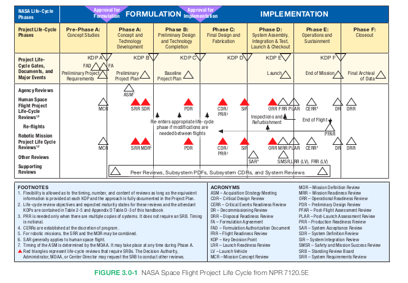

###
IEEE 21840
IEEE 15288
Um dos conceitos fundamentais utilizados na NASA para a gestão de grandes sistemas é o ciclo de vida de programa/projeto, que categoriza tudo o que deve ser feito para realizar um programa ou projeto em fases distintas, separadas por Pontos de Decisão Chave (KDPs). Os KDPs são eventos nos quais a autoridade responsável pela decisão determina a prontidão de um programa/projeto para avançar para a próxima fase do ciclo de vida (ou para o próximo KDP). Os limites das fases são definidos de forma a fornecer pontos naturais para decisões de "prosseguir" ou "não prosseguir". As decisões para avançar podem ser condicionadas a pendências que devem ser resolvidas dentro de um prazo acordado. Um programa ou projeto que não passar por um KDP pode ter a chance de tentar novamente após corrigir as deficiências que impediram sua aprovação, ou pode ser encerrado.

Todos os sistemas começam com o reconhecimento de uma necessidade ou a descoberta de uma oportunidade e avançam por várias etapas de desenvolvimento até o final do projeto. Embora os impactos mais significativos das atividades de análise e otimização associadas à engenharia de sistemas sejam obtidos nas fases iniciais, as decisões que afetam os custos continuam a ser influenciadas pela abordagem sistêmica mesmo à medida que o ciclo de vida do sistema se aproxima do fim.

A decomposição do ciclo de vida de um programa/projeto em fases organiza todo o processo em partes mais gerenciáveis. O ciclo de vida do programa/projeto deve proporcionar aos gestores uma visão incremental do progresso alcançado, em momentos que se alinhem ao ambiente de gestão e orçamento.

Para os projetos da NASA, o ciclo de vida é definido no documento normativo aplicável:
- Para projetos de voos espaciais: **NPR 7120.5** – Requisitos de Gestão de Programas e Projetos de Voos Espaciais da NASA
- Para tecnologia da informação: **NPR 7120.7** – Requisitos de Gestão de Programas e Projetos de Tecnologia da Informação e Infraestrutura Institucional da NASA
- Para pesquisa e tecnologia da NASA: **NPR 7120.8** – Requisitos de Gestão de Programas e Projetos de Pesquisa e Tecnologia da NASA
- Para software: **NPR 7150.2** – Requisitos de Engenharia de Software da NASA
Por exemplo, o **NPR 7120.5** define as principais fases do ciclo de vida da NASA como **Formulação** e **Implementação**. Para projetos de sistemas de voo espacial, as fases do ciclo de vida da NASA, **Formulação** e **Implementação**, são divididas nas seguintes sete etapas incrementais. As fases do ciclo de vida do projeto são:

**Pré-Formulação do Programa**:
- **Pré-Fase A**: Estudos de Conceito

**Formulação do Programa**:
- **Fase A**: Desenvolvimento de Conceito e Tecnologia
- **Fase B**: Projeto Preliminar e Conclusão da Tecnologia
**Implementação do Programa**:
- **Fase C**: Projeto Final e Fabricação
- **Fase D**: Montagem, Integração e Teste do Sistema, Lançamento
- **Fase E**: Operações e Sustentação
- **Fase F**: Encerramento

A **FIGURA 3.0-1** é retirada do **NPR 7120.5** e apresenta o ciclo de vida dos projetos de voo espacial da NASA, identificando os KDPs e as revisões que caracterizam as fases. Mais informações sobre ciclos de vida podem ser encontradas no documento **NASA Expanded Guidance for SE** no link [https://nen.nasa.gov/web/se/doc-repository](https://nen.nasa.gov/web/se/doc-repository) e no **SP-2014-3705, NASA Space Flight Program and Project Management Handbook**.

A **TABELA 3.0-1** é retirada do **NPR 7123.1** e representa a maturidade do produto para os principais produtos de engenharia de sistemas (SE) desenvolvidos e amadurecidos durante o ciclo de vida do produto.

### 3.1 Formulação do Programa

A fase de **Formulação do Programa** estabelece um programa custo-efetivo que é claramente capaz de atender aos objetivos e metas da Agência e da diretoria da missão. O **Documento de Autorização da Formulação do Programa (FAD)** autoriza o **Gerente de Programa (PM)** a iniciar o planejamento de um novo programa e realizar as análises necessárias para formular um plano de programa sólido. O engenheiro chefe de sistemas fornece o planejamento técnico e o desenvolvimento de conceitos para esta fase do ciclo de vida do programa. O planejamento inclui a identificação das principais revisões técnicas necessárias e os critérios de entrada e saída associados. As principais revisões que levam à aprovação no **KDP I** são:
- **SRR** (System Requirements Review)
- **SDR** (System Design Review)
- **PDR** (Preliminary Design Review)
- Revisões de Gestão do Programa governantes.

Revisão do **Council (PMC)**. Um resumo dos produtos de gate exigidos para a fase de **Formulação do Programa** pode ser encontrado na diretiva normativa da NASA aplicável (por exemplo, **NPR 7120.5** para programas de voo espacial, **NPR 7120.7** para projetos de TI, **NPR 7120.8** para projetos de pesquisa e tecnologia). A **Formulação** para todos os tipos de programa é a mesma, envolvendo uma ou mais revisões do programa seguidas pelo **KDP I**, onde é tomada a decisão de aprovar o programa para iniciar a implementação.

### 3.2 Implementação do Programa

Durante a fase de **Implementação do Programa**, o **PM** trabalha com o **Administrativo Associado da Diretoria da Missão (MDAA)** e o projeto constituinte...
Os gerentes do programa trabalham para executar o plano do programa de forma custo-efetiva. As revisões do programa garantem que o programa continue contribuindo para as metas e objetivos da Agência e da diretoria da missão, dentro das limitações orçamentárias. Um resumo dos produtos de gate exigidos para a fase de Implementação do Programa pode ser encontrado na diretiva normativa da NASA aplicável, por exemplo, NPR 7120.5 para programas de voo espacial. O ciclo de vida do programa possui dois caminhos de implementação diferentes, dependendo do tipo de programa. Cada caminho de implementação tem diferentes tipos de revisões importantes. É fundamental para o engenheiro de sistemas saber a qual tipo de programa um projeto pertence, para que o escopo apropriado do trabalho técnico, os requisitos de documentação e o conjunto de revisões possam ser determinados.

### 3.3 Projeto Pré-Fase A: Estudos de Conceito

O objetivo da **Pré-Fase A** é produzir uma ampla gama de ideias e alternativas para missões, a partir das quais novos programas/projetos podem ser selecionados. Durante a **Pré-Fase A**, uma equipe de estudo ou proposta analisa uma ampla variedade de conceitos de missão que se enquadram nas restrições técnicas, de custo e de cronograma, e que contribuem para as metas e objetivos do programa e da Diretoria da Missão. O esforço da **Pré-Fase A** pode incluir exames focados em áreas de alto risco ou de desenvolvimento de tecnologia avançada. Esses estudos avançados, juntamente com as interações com clientes e outros potenciais stakeholders, ajudam a equipe a identificar o(s) conceito(s) de missão promissores. Os **principais stakeholders** (incluindo o cliente) são determinados eas a basis for further development. Durante a **Pré-Fase A**, se conceitos viáveis forem encontrados, um ou mais podem ser selecionados para a **Fase A** para desenvolvimento adicional. Normalmente, os engenheiros de sistemas estão fortemente envolvidos no desenvolvimento e avaliação das opções de conceito. Em projetos regidos pelo **NPR 7120.5**, as **opções de desescalonamento (descope)** definem o que o sistema pode realizar caso os recursos não estejam disponíveis para cumprir toda a missão. Isso pode ser na forma de menos instrumentos, um perfil de missão menos ambicioso, realizar apenas alguns objetivos ou usar tecnologia mais barata e menos capaz. As opções de desescalonamento também podem refletir o que a missão pode alcançar caso ocorra uma falha de hardware, resultando na perda de uma parte da arquitetura da espaçonave; por exemplo, o que um orbitador pode alcançar após a perda de um lander. Os critérios de sucesso são reduzidos para corresponder a uma missão com escopo reduzido.

As **opções de desescalonamento** são desenvolvidas quando a documentação de expectativas das **ONGs** ou outros stakeholders é elaborada. A equipe do projeto desenvolve um conjunto preliminar de opções de desescalonamento como produto de gate para a **MCR (Mission Concept Review)**, mas essas opções preliminares não são baseadas ou mantidas. Elas são mantidas no arquivo de documentação para o caso de serem necessárias mais tarde no ciclo de vida do projeto.

É importante, na **Pré-Fase A**, definir com precisão o grupo de stakeholders e usuários para ajudar a garantir que os objetivos da missão e os conceitos operacionais atendam às necessidades e expectativas dos usuários finais. Além disso, é essencial estimar a composição da equipe técnica e identificar quaisquer requisitos exclusivos de instalações ou pessoal.

Os **estudos avançados** podem se estender por vários anos e normalmente se concentram em estabelecer os objetivos da missão e formular os requisitos do sistema de alto nível e **ConOps (Conceitos de Operações)**. Desenhos conceituais podem ser desenvolvidos para demonstrar viabilidade e apoiar estimativas programáticas. A ênfase está em estabelecer a viabilidade como base para o desenvolvimento adicional.

established with more precision, and the focus shifts toward ensuring that the mission is both feasible and cost-effective. During **Fase A**, a proposta de arquitetura de missão/sistema é desenvolvida para ser credível e responsiva às expectativas do programa, aos requisitos e às restrições do projeto, incluindo recursos. Durante esta fase, são realizadas atividades para desenvolver completamente o conceito base da missão, iniciar ou assumir a responsabilidade pelo desenvolvimento das tecnologias necessárias e esclarecer a dependência esperada de elementos humanos para alcançar a funcionalidade completa do sistema ou para o desenvolvimento de um sistema autônomo.

Esse trabalho, juntamente com as interações com stakeholders, ajuda a amadurecer o conceito da missão e os requisitos do programa no projeto. Os engenheiros de sistemas estão fortemente envolvidos durante essa fase no desenvolvimento e avaliação da arquitetura e na alocação dos requisitos aos elementos da arquitetura.

Na **Fase A**, uma equipe—geralmente associada a um programa ou escritório informal de projeto—reavalia o conceito da missão inicialmente desenvolvido na **Pré-Fase A** para garantir que a justificativa do projeto e a praticidade sejam suficientes para garantir um lugar no orçamento da NASA. O esforço da equipe foca na análise dos requisitos da missão e no estabelecimento de uma arquitetura para a missão. As atividades tornam-se formais, e a ênfase muda para a otimização do design do conceito. O trabalho aborda maior profundidade e considera várias alternativas. Os **objetivos e metas** são definidos com mais precisão, e a missão é refinada para garantir sua viabilidade e custo-benefício.
### 3.4 Project Phase A: Concept and Technology Development

definidos com maior precisão, e a missão é refinada para garantir sua viabilidade e custo-benefício. Durante a **Fase A: Desenvolvimento do Conceito e da Tecnologia**, a principal missão é criar uma arquitetura de missão/sistema que seja credível e responsiva às expectativas do programa, aos requisitos e às restrições do projeto, incluindo os recursos disponíveis.

Durante esta fase, as atividades incluem o desenvolvimento completo do conceito base da missão, a iniciação ou assunção da responsabilidade pelo desenvolvimento das tecnologias necessárias e a clarificação da dependência esperada de elementos humanos para alcançar a funcionalidade completa do sistema ou para o desenvolvimento de um sistema autônomo. Esse trabalho, juntamente com as interações com os stakeholders, ajuda a amadurecer tanto o conceito da missão quanto os requisitos do programa no projeto. Os engenheiros de sistemas desempenham um papel fundamental no desenvolvimento e avaliação da arquitetura e na alocação de requisitos aos elementos da arquitetura.

Na **Fase A**, uma equipe, geralmente associada a um programa ou escritório informal de projeto, reavalia o conceito da missão inicialmente desenvolvido na **Pré-Fase A**, garantindo que a justificativa do projeto e a sua viabilidade sejam suficientes para garantir uma posição no orçamento da NASA. O foco do trabalho da equipe está na análise dos requisitos da missão e no estabelecimento de uma arquitetura para a missão. As atividades tornam-se formais, com a ênfase deslocando-se para a otimização do design do conceito. O trabalho envolve uma análise mais profunda e a consideração de várias alternativas.

Durante a **Fase A**, o objetivo é desenvolver uma arquitetura proposta de missão/sistema que seja credível e responda às expectativas do programa, requisitos e restrições do projeto, incluindo recursos. Nessa fase, são realizadas atividades para desenvolver completamente um conceito de missão base, iniciar ou assumir a responsabilidade pelo desenvolvimento das tecnologias necessárias e esclarecer a dependência esperada de elementos humanos para alcançar a funcionalidade completa do sistema ou o desenvolvimento autônomo do sistema. Esse trabalho, juntamente com as interações com as partes interessadas, ajuda a amadurecer o conceito da missão e os requisitos do programa no projeto. Os engenheiros de sistemas estão fortemente envolvidos durante essa fase no desenvolvimento e avaliação da arquitetura e na alocação de requisitos para os elementos da arquitetura.

Na Fase A, uma equipe – muitas vezes associada a um programa ou escritório de projeto informal – revisita o conceito de missão inicialmente desenvolvido na Pré-Fase A para garantir que a justificativa e a praticidade do projeto sejam suficientes para garantir um lugar no orçamento da NASA. O esforço da equipe se concentra na análise dos requisitos da missão e no estabelecimento de uma arquitetura da missão. As atividades se tornam formais e a ênfase passa a ser otimizar o design do conceito. O trabalho se aprofunda mais e considera muitas alternativas. Os objetivos e metas são solidificados e o projeto desenvolve mais definição nos requisitos do sistema, na arquitetura do sistema de alto nível e no ConOps. Os designs conceituais e as análises (incluindo unidades de engenharia e modelos físicos, conforme apropriado) são desenvolvidos e apresentam mais detalhes de engenharia do que na Pré-Fase A. Os riscos técnicos são identificados com mais detalhes e as necessidades de desenvolvimento de tecnologia se tornam mais focadas. Um **Plano de Gestão da Engenharia de Sistemas (SEMP)** é formalizado na Fase A para documentar como os requisitos de engenharia de sistemas da NASA e as práticas do **NPR 7123.1** serão abordados ao longo do ciclo de vida do programa.

Na Fase A, o esforço se concentra na alocação de funções para itens específicos de hardware, software e para seres humanos. Os requisitos funcionais e de desempenho do sistema, juntamente com as arquiteturas e os designs, se tornam firmes à medida que as trocas de sistemas e subsistemas são iteradas de forma colaborativa com especialistas no assunto, buscando designs mais econômicos. Um método de determinação do custo do ciclo de vida (ou seja, modelo de custo-efetividade em nível de sistema) é refinado para comparar os impactos dos custos de cada uma das alternativas. (Estudos de trade-off devem preceder—e não seguir— as decisões de design do sistema.) Os principais produtos até este ponto incluem uma linha de base funcional aceita para o sistema e seus principais itens finais. A equipe do projeto realiza a categorização de segurança dos sistemas de TI exigida pelo **NPR 2810.1** e pelo **Federal Information Processing Standard (FIPS) 199**, que envolve determinar os níveis de impacto de segurança do sistema com base nos requisitos de confidencialidade, integridade e disponibilidade. Este é um passo essencial para garantir que os sistemas de TI atendam aos padrões de segurança exigidos e cumpram com as regulamentações federais.
### Fase B do Projeto: Projeto Preliminar e Conclusão de Tecnologia

O objetivo da **Fase B** é que a equipe do projeto conclua o desenvolvimento de tecnologias, protótipos de engenharia, avaliações de hardware e software de herança e outras atividades de mitigação de risco identificadas no Acordo de Formulação do Projeto (FA) e no projeto preliminar. O projeto demonstra que suas linhas de base de planejamento, técnicas, de custo e de cronograma desenvolvidas durante a Formulação estão completas e consistentes; que o projeto preliminar está em conformidade com seus requisitos; que o projeto está suficientemente maduro para iniciar a Fase C; e que o custo e o cronograma são adequados para possibilitar o sucesso da missão com risco aceitável. É ao final dessa fase que o projeto e a Agência se comprometem a alcançar os objetivos do projeto dentro de um custo e cronograma definidos.

Para projetos com um **Custo de Ciclo de Vida (LCC)** superior a 250 milhões de dólares, esse compromisso é formalizado com o Congresso e o Escritório de Gestão e Orçamento dos EUA (OMB). Esse compromisso externo é conhecido como **Compromisso de Linha de Base da Agência (ABC)**.

**Engenheiros estão envolvidos nesta fase para garantir que os projetos preliminares dos diversos sistemas funcionem de forma integrada, sejam compatíveis e provavelmente atendam às expectativas dos clientes e aos requisitos aplicáveis.** Durante a **Fase B**, são realizadas atividades para estabelecer uma linha de base inicial do projeto, que (de acordo com o NPR 7120.5 e NPR 7123.1) inclui "um fluxo formal dos requisitos de desempenho do nível do projeto para um conjunto completo de especificações de projeto de sistemas e subsistemas para os elementos de voo e solo" e "projetos preliminares correspondentes".

Os requisitos técnicos devem ser detalhados o suficiente para estabelecer estimativas firmes de cronograma e custo para o projeto. Também é importante observar, especialmente para projetos impulsionados por AO (Autoridades de Ordem), que a **Fase B** é onde os requisitos de alto nível e os requisitos derivados para o próximo nível são finalizados e colocados sob controle de configuração. Embora os requisitos devam ser estabelecidos na Fase A, mudanças resultantes de estudos de trade-offs e análises no final da Fase A e início da Fase B podem levar a alterações ou refinamentos nos requisitos do sistema.

É importante, na **Fase B**, validar as decisões de design com base nos objetivos e metas originais e no **ConOps** (Conceito de Operações). Todos os aspectos do ciclo de vida devem ser considerados, incluindo decisões de design que afetam treinamento, gerenciamento de recursos operacionais, fatores humanos, segurança, habitabilidade e ambiente, além de manutenção e suporte.

A linha de base da **Fase B** consiste em uma coleção de linhas de base em evolução, cobrindo aspectos técnicos e comerciais do projeto: requisitos e especificações de sistemas (e subsistemas), projetos, planos de verificação e operações, e assim por diante, na parte técnica da linha de base; e cronogramas, projeções de custos e planos de gerenciamento, na parte comercial. O estabelecimento de linhas de base implica a implementação de procedimentos de gerenciamento de configuração. (Ver Seção 6.5.)

A **Fase B** culmina em uma série de PDRs (Revisões de Projeto Preliminar), incluindo o PDR de nível de sistema e PDRs para itens de nível inferior, conforme apropriado. Os PDRs refletem o refinamento sucessivo dos requisitos em designs. Questões de design identificadas nos PDRs devem ser resolvidas para que o design final possa começar com especificações de design claras. A partir desse ponto, quase todas as mudanças na linha de base devem representar refinamentos sucessivos, e não mudanças fundamentais. Como mencionado na **FIGURA 2.5-1**, mudanças significativas de design a partir da Fase B tornam-se progressivamente mais caras.

**Fase C: Projeto Final e Fabricação**
O objetivo da **Fase C** é completar e documentar o design detalhado do sistema que atende aos requisitos detalhados e fabricar, codificar ou realizar de outra forma os produtos. Durante a Fase C, são realizadas atividades para estabelecer um design completo (linha de base do produto), fabricar ou produzir hardware, e codificar software em preparação para a integração. Estudos de trade-offs continuam e seus resultados são usados para validar o design em relação aos objetivos do projeto, metas e **ConOps**. Unidades de teste de engenharia, mais próximas do hardware real, são construídas e testadas para estabelecer confiança de que o design funcionará nos ambientes esperados. Sujeitos humanos representando a população usuária participam das avaliações operacionais do design, uso, manutenção, procedimentos de treinamento e interfaces. Os resultados de análises de especialidades de engenharia e análises transversais são integrados ao design, e o processo de fabricação e controles são definidos e validados.

Os engenheiros de sistemas estão envolvidos nesta fase para garantir que os designs detalhados finais dos diversos sistemas funcionarão juntos, são compatíveis e provavelmente atenderão às expectativas dos clientes e aos requisitos aplicáveis. Durante a fabricação, o engenheiro de sistemas está disponível para responder a perguntas e resolver quaisquer problemas de interface que possam surgir.

Todo o planejamento iniciado na **Fase A** para os equipamentos de teste e operacionais, processos e análises, integração das análises transversais e de especialidade de engenharia, e processos e controles de fabricação é implementado. O gerenciamento de configuração continua a rastrear e controlar as mudanças de design à medida que as interfaces detalhadas são definidas. A cada passo no refinamento sucessivo do design final, as atividades de integração e verificação correspondentes são planejadas em maior detalhe. Durante essa fase, os parâmetros técnicos, cronogramas e orçamentos são monitorados de perto para garantir que tendências indesejáveis (como crescimento inesperado da massa da espaçonave ou aumento de seu custo) sejam reconhecidas a tempo de tomar ações corretivas. Essas atividades se concentram na preparação para o **CDR** (Revisão do Projeto Crítico), **PRR** (Revisão de Prontidão para Produção) (se necessário) e **SIR** (Revisão de Sistema de Integração).

A **Fase C** contém uma série de **CDRs**, incluindo o **CDR de nível de sistema** e **CDRs** correspondentes aos diferentes níveis da hierarquia do sistema. Um **CDR** para cada item final deve ser realizado antes do início da fabricação/produção do hardware e antes do início da codificação dos produtos de software entregáveis. Normalmente, a sequência de **CDRs** reflete o processo de integração que ocorrerá na fase seguinte; ou seja, de **CDRs** de nível inferior para o **CDR** de nível de sistema. No entanto, os projetos devem ajustar a sequência das revisões para atender às necessidades do projeto. Se houver uma produção em massa de produtos, uma **PRR** será realizada para garantir que os planos de produção, instalações e pessoal estejam prontos para iniciar a produção. A **Fase C** culmina com um **SIR**. Requisitos de treinamento e preliminares.
os procedimentos de operações da missão são criados e estabelecidos como base. O produto final dessa fase é um produto pronto para integração.

### Fase D: Montagem do Sistema, Integração e Testes, Lançamento
O objetivo da **Fase D** é montar, integrar, verificar, validar e lançar o sistema. Essas atividades têm como foco a preparação para a **Revisão de Prontidão para o Voo** (FRR) / **Revisão de Prontidão para a Missão** (MRR). As atividades incluem montagem, integração, verificação e validação do sistema, incluindo testes do sistema de voo em ambientes esperados dentro das margens. Outras atividades incluem a atualização dos procedimentos operacionais, ensaios e treinamento do pessoal de operação e membros da tripulação, além da implementação do planejamento logístico e de peças sobressalentes. Para projetos de voo, o foco das atividades muda para a integração pré-lançamento e o lançamento.

A engenharia de sistemas está envolvida em todos os aspectos dessa fase, incluindo responder a perguntas, fornecer conselhos, resolver problemas, avaliar os resultados dos testes de verificação e validação, garantir que os resultados de V&V atendam às expectativas do cliente e aos requisitos aplicáveis, e fornecer informações aos tomadores de decisão para decisões de **go/no-go**.

O planejamento para as atividades da **Fase D** foi iniciado na **Fase A**. Para projetos de TI, consulte o **Manual de Engenharia de Sistemas de TI**. O planejamento das atividades deve ser realizado o mais cedo possível, uma vez que As mudanças nesse ponto podem se tornar custosas. A **Fase D** conclui com um sistema que demonstrou ser capaz de cumprir o objetivo para o qual foi criado.

### Fase E: Operações e Sustentação
O objetivo da **Fase E** é realizar a missão principal para atender à necessidade inicialmente identificada e manter o suporte para essa necessidade. Os produtos dessa fase são os resultados da missão e o desempenho do sistema.

Pessoal de engenharia de sistemas continua a desempenhar um papel durante essa fase, já que a integração frequentemente se sobrepõe às operações para sistemas complexos. Alguns programas têm operações/voos repetidos que exigem mudanças de configuração e novos objetivos de missão a cada ocorrência. Sistemas com necessidades complexas de sustentação ou envolvimento humano provavelmente precisarão de avaliações e ajustes que podem estar além do escopo dos operadores. Disciplinas de engenharia especializadas, como manutenção e serviços logísticos, também realizarão tarefas durante essa fase. Tais tarefas podem exigir iteração e/ou recursão dos processos comuns de engenharia de sistemas.

O pessoal de engenharia de sistemas também pode estar envolvido na resolução de anomalias durante o voo. Além disso, o desenvolvimento de software pode continuar bem na Fase E. Por exemplo, o software para uma sonda planetária pode ser desenvolvido e enviado enquanto estiver em voo. Outro exemplo seria o desenvolvimento de novos hardwares para incrementos da estação espacial.As mudanças nesse ponto podem se tornar custosas. A **Fase D** conclui com um sistema que demonstrou ser capaz de cumprir o objetivo para o qual foi criado.

### Fase E: Operações e Sustentação
O objetivo da **Fase E** é realizar a missão principal para atender à necessidade inicialmente identificada e manter o suporte para essa necessidade. Os produtos dessa fase são os resultados da missão e o desempenho do sistema.

Pessoal de engenharia de sistemas continua a desempenhar um papel durante essa fase, já que a integração frequentemente se sobrepõe às operações para sistemas complexos. Alguns programas têm operações/voos repetidos que exigem mudanças de configuração e novos objetivos de missão a cada ocorrência. Sistemas com necessidades complexas de sustentação ou envolvimento humano provavelmente precisarão de avaliações e ajustes que podem estar além do escopo dos operadores. Disciplinas de engenharia especializadas, como manutenção e serviços logísticos, também realizarão tarefas durante essa fase. Tais tarefas podem exigir iteração e/ou recursão dos processos comuns de engenharia de sistemas.

O pessoal de engenharia de sistemas também pode estar envolvido na resolução de anomalias durante o voo. Além disso, o desenvolvimento de software pode continuar bem na Fase E. Por exemplo, o software para uma sonda planetária pode ser desenvolvido e enviado enquanto estiver em voo. Outro exemplo seria o desenvolvimento de novos hardwares para incrementos da estação espacial.

ou seja, elas não podem ser removidas da órbita de maneira controlada de forma simples devido à sua grande altitude e à falta de um mecanismo eficaz para reduzir a velocidade e trazer essas satélites de volta à atmosfera. Em vez disso, as diretrizes recomendam que essas satélites sejam movidos para uma "órbita cemitério", uma órbita mais alta onde não representem risco para outros satélites ou para a operação de missões espaciais.

Essa abordagem ajuda a mitigar o problema do aumento de detritos espaciais, que é uma preocupação crescente à medida que o número de satélites em órbita aumenta. Para garantir que os satélites não se tornem fontes de detritos, a NASA e outras organizações espaciais têm regulamentações rigorosas e práticas recomendadas, como a **NPR 8715.6**, que visa minimizar o impacto ambiental e garantir a segurança a longo prazo do espaço orbital.

Além disso, em algumas situações, avanços tecnológicos podem tornar economicamente inviável continuar operando um sistema, seja em sua configuração atual ou com melhorias, o que pode levar ao encerramento prematuro da missão.

Além de abordar as atividades da fase final, é importante considerar o aspecto financeiro de uma missão espacial. O **financiamento** e o ciclo orçamentário desempenham um papel crucial em cada fase, garantindo que os recursos sejam adequadamente alocados ao longo do ciclo de vida do projeto.

O **ciclo orçamentário** da NASA envolve o planejamento, a obtenção de recursos financeiros e a gestão das finanças ao longo das várias fases de uma missão ou projeto. O processo inclui a formulação do orçamento, a execução e a elaboração de relatórios para garantir que o projeto permaneça no caminho certo, tanto financeiramente quanto operacionalmente. Isso envolve a previsão de custos relacionados ao design, desenvolvimento, operações e descomissionamento, que são essenciais para evitar estouros orçamentários e garantir o sucesso do projeto.

Para informações mais detalhadas sobre o **ciclo orçamentário da NASA** e a gestão financeira dentro do contexto da engenharia de sistemas, você pode consultar o [Guia Expandido da NASA para Engenharia de Sistemas](https://nen.nasa.gov/web/se/doc-repository) e outras documentações relacionadas, como o **Manual de Gerenciamento de Programas e Projetos de Voo Espacial da NASA**.

O planejamento orçamentário adequado e a gestão financeira são cruciais para a sustentabilidade a longo prazo das missões e operações espaciais, pois ajudam a gerenciar riscos, garantir que os recursos necessários estejam disponíveis e levar em conta possíveis mudanças futuras no escopo da missão.
### 3.11 Ajuste e Personalização dos Requisitos do NPR 7123.1

Nesta seção, o termo "requisitos" se refere às declarações do tipo "deve" impostas por diretrizes da Agência. A discussão se concentra no ajuste dos requisitos contidos no NPR 7123.1.

#### 3.11.1 Introdução

A política da NASA reconhece a necessidade de acomodar os aspectos únicos de cada programa ou projeto para alcançar o sucesso da missão de forma eficiente e econômica. O **ajuste** é um processo utilizado para alcançar esse objetivo.

O NPR 7123.1 define o ajuste como "o processo utilizado para buscar alívio dos requisitos do SE NPR de forma consistente com os objetivos do programa ou projeto, o risco permitido e as restrições." O ajuste resulta em desvios ou isenções (veja o NPR 7120.5, Seção 3.5) dos requisitos de SE e é documentado na próxima revisão do SEMP (por exemplo, por meio da **Matriz de Conformidade**).

Como o NPR 7123.1 foi escrito para acomodar programas e projetos independentemente de seu tamanho ou complexidade, os requisitos do NPR deixam uma grande latitude para interpretação. Portanto, o termo "personalização" é introduzido e definido como "a modificação das práticas recomendadas de SE que são usadas para cumprir os requisitos de SE." A personalização não requer isenções ou desvios, mas personalizações significativas devem ser documentadas no SEMP.

O ajuste e a personalização são ferramentas essenciais de engenharia de sistemas, sendo parte aceita e esperada do estabelecimento dos requisitos adequados do SE NPR para um programa ou projeto. Embora o ajuste seja esperado para todos os tamanhos de projetos e programas, projetos pequenos apresentam oportunidades e desafios diferentes daqueles encontrados em grandes projetos tradicionais, como o **Shuttle**, a **Estação Espacial Internacional**, o **Telescópio Espacial Hubble** e o **Mars Science Laboratory**.
Embora os aspectos técnicos de projetos pequenos sejam geralmente mais restritos e focados, eles também podem ser desafiadores quando seus objetivos envolvem demonstrar tecnologias avançadas ou fornecer capacidades "únicas". Ao mesmo tempo, seus orçamentos relativamente pequenos e cronogramas restritos exigem abordagens enxutas e inovadoras para gestão de projetos e engenharia de sistemas. O ajuste e a personalização permitem que programas e projetos sejam bem-sucedidos no alcance de objetivos técnicos dentro das restrições de custo e cronograma. A chave está em um ajuste eficaz que reflita as lições aprendidas e as melhores práticas.

Ajustar os requisitos de SE e personalizar as melhores práticas de SE para as necessidades específicas do projeto ajuda a obter os benefícios desejados, enquanto elimina sobrecargas desnecessárias. Para isso, é necessário entender e concordar com uma postura de risco aceitável entre o projeto, o cliente/parte interessada, a gestão do centro e os revisores independentes. Mesmo com essa base, no entanto, o processo real de ajustar adequadamente os requisitos de SE e personalizar as práticas do NPR 7123.1 para um projeto específico pode ser complicado e árduo. Abordagens eficazes e mentores experientes tornam o processo de ajuste para qualquer projeto mais sistemático e eficiente.

O Capítulo 6 do **NASA Software Engineering Handbook** fornece orientações sobre o ajuste dos requisitos de SE para projetos de software.

#### 3.11.2 Critérios para Ajuste

O **NPR 8705.4**, *Risk Classification for NASA Payloads*, destina-se à atribuição de uma classificação de risco para projetos e programas. Ele estabelece critérios básicos que permitem aos usuários definir o nível de classificação de risco para cargas úteis da NASA em sistemas de lançamento ou veículos transportadores, sejam eles classificados para missões com ou sem tripulação. Também é um ponto de partida para entender e definir critérios para o ajuste.

A extensão do ajuste aceitável depende de várias características do programa/projeto, como as seguintes:
1. **Tipo de missão.** Por exemplo, os requisitos para uma missão espacial tripulada são muito mais rigorosos do que para uma missão robótica pequena.

2. **Crucialidade da missão em atender ao Plano Estratégico da Agência.** Missões críticas que devem ser bem-sucedidas podem não ter isenção dos requisitos do NPR.

3. **Nível de risco aceitável.** Se a Agência e o cliente estiverem dispostos a aceitar um risco maior de falha, alguns requisitos do NPR podem ser dispensados.

4. **Significância nacional.** Um projeto de grande importância nacional pode não ser isento dos requisitos do NPR.

5. **Complexidade.** Missões altamente complexas podem exigir mais requisitos do NPR para manter os sistemas compatíveis, enquanto missões mais simples podem não exigir o mesmo nível de rigor.

6. **Duração da missão.** Missões com uma vida útil mais longa precisam aderir mais estritamente aos requisitos do NPR do que programas/projetos de curta duração.

7. **Custo da missão.** Missões de custo mais alto podem exigir maior aderência aos requisitos do NPR para garantir um controle adequado do programa/projeto.

8. **Restrições de lançamento.** Se houver várias restrições de lançamento, um projeto pode precisar estar mais plenamente em conformidade com os requisitos da Agência.

#### 3.11.3 Ajuste dos Requisitos SE do NPR Usando a Matriz de Conformidade

O **NPR 7123.1** inclui uma **Matriz de Conformidade** (Apêndice H.2) para auxiliar programas e projetos a verificarem se atendem aos requisitos especificados do NPR. A Matriz de Conformidade documenta a conformidade do programa/projeto ou a intenção de cumprir com os requisitos do NPR.
Os requisitos do NPR ou a justificativa para o ajuste são documentados na **Matriz de Conformidade**. Ela pode ser usada para ajudar a identificar onde ocorrerá a personalização significativa da forma (por exemplo, formalidade e rigor) em que os requisitos do NPR serão cumpridos e para comunicar essa personalização aos envolvidos. O processo de ajuste (que pode ocorrer a qualquer momento no ciclo de vida do programa ou projeto) resulta em desvios ou isenções dos requisitos do NPR, dependendo do momento do pedido. Desvios e isenções dos requisitos podem ser submetidos separadamente à **Autoridade Governante Designada** ou por meio da Matriz de Conformidade.

A Matriz de Conformidade é anexada ao **Plano de Gestão de Engenharia de Sistemas** (SEMP) quando submetido para aprovação. Alternativamente, se não houver um SEMP independente e os conteúdos do SEMP forem incorporados em outro documento, como o plano do projeto, a Matriz de Conformidade pode ser capturada dentro desse plano.

A **Figura 3.11-1** ilustra um processo de ajuste hipotético para um projeto de voo espacial. A gestão do projeto (como o gerente do projeto, o Investigador Principal, o líder da tarefa, etc.) monta uma equipe de projeto para ajustar os requisitos do NPR codificados na Matriz de Conformidade. Para classificar adequadamente o projeto, a equipe (engenheiro chefe, engenheiro principal de sistemas, segurança e garantia da missão, etc.) precisa entender os blocos fundamentais do projeto, como as necessidades, metas e objetivos, bem como a postura de risco apropriada.

Através de um processo iterativo, a equipe do projeto percorre os requisitos do NPR na Matriz de Conformidade para ajustá-los. Uma ferramenta de ajuste com diretrizes sugeridas pode facilitar o processo de ajuste, caso esteja disponível. Vários Centros da NASA, incluindo LaRC e MSFC, desenvolveram ferramentas para uso em seus Centros, que podem ser adaptadas para outros Centros. A orientação de **Especialistas em Assuntos Específicos** (SMEs) deve ser buscada para determinar a quantidade apropriada de ajuste para um projeto específico.
A **Matriz de Conformidade** fornece justificativas para cada um dos requisitos do **NPR** a fim de ajudar na compreensão. Uma vez que o ajuste (tailoring) seja finalizado e registrado na Matriz de Conformidade com as justificativas apropriadas, o ajuste solicitado segue pelo modelo de governança apropriado para aprovação.
**3.11.4 Formas de Ajustar um Requisito de Engenharia de Sistemas (SE)**

O ajuste geralmente ocorre em três áreas:

1. **Eliminação de um requisito que não se aplica ao programa/projeto específico.**

2. **Eliminação de um requisito que é excessivamente oneroso** (ou seja, quando o custo de implementar o requisito adiciona mais risco ao projeto, desviando recursos, do que o risco de não cumprir o requisito).
3. **Dimensionar o requisito de forma que equilibre melhor o custo de implementação e o risco do projeto.**
A personalização das práticas de SE pode incluir o seguinte:

1. Ajustar a forma como cada um dos 17 processos de SE é implementado.
2. Ajustar a formalidade e o momento das revisões.

3.11.4.1 **Requisitos Não Aplicáveis do NPR**

Cada requisito no NPR 7123.1 é avaliado quanto à aplicabilidade ao projeto ou programa individual. Por exemplo, se o projeto for desenvolvido completamente internamente, os requisitos do Capítulo 4 do NPR sobre contratos não seriam aplicáveis. Se um sistema não contiver software, então nenhum dos requisitos do NPR para o desenvolvimento e manutenção de software seria aplicável.

3.11.4.2 **Ajustando o Escopo**

Dependendo do projeto ou programa, pode ser apropriado aliviar o escopo de um requisito. Por exemplo, embora a diretiva de gerenciamento de projetos vigente (por exemplo, NPR 7120.5, 7150.2, 7120.7, 7120.8) para um programa/projeto possa exigir que certos documentos sejam independentes, o SE NPR não exige documentos adicionais independentes. Para projetos pequenos, muitos dos planos podem ser descritos em apenas alguns parágrafos ou páginas. Em tais projetos, qualquer requisito do NPR que estipule que os planos precisam ser documentos independentes seria excessivo. Nesses casos, a informação pode ser simplesmente escrita e incluída como parte do plano do projeto ou do SEMP.

Se a diretiva de gerenciamento de projetos aplicável (por exemplo, NPR 7120.5 ou NPR 7120.8) exigir documentos independentes, é necessário um pedido de isenção/desvio do programa/projeto. No entanto, se não houver exigência ou expectativa do Centro para um documento independente, o projeto pode personalizar onde essa informação será registrada, sem a necessidade de isenção ou desvio. Registrar onde essa informação é documentada na Matriz de Conformidade de engenharia de sistemas ou gerenciamento de projetos seria útil para clareza.

3.11.4.3 **Formalidade e Cronograma das Revisões**

A diretiva de gerenciamento de projetos vigente identifica o ciclo de vida requerido ou recomendado para o tipo específico de programa/projeto. O ciclo de vida define o número e o timing das várias revisões; no entanto, há uma considerável discrição quanto à formalidade da revisão e como ela deve ser conduzida. O Apêndice G do NPR 7123.1 fornece uma orientação extensa para os critérios de entrada e sucesso sugeridos para as revisões. Espera-se que o programa/projeto personalize esses critérios de maneira que faça sentido para o seu programa/projeto. O SE NPR não exige uma isenção/desvio para essa personalização; no entanto, desvios dos elementos de revisão exigidos por outros NPRs precisam ser tratados ajustando esses documentos.

Se um programa/projeto decidir que não precisa de uma das revisões exigidas, é necessário um pedido de isenção ou desvio. No entanto, o SE NPR não especifica um espaçamento mínimo para essas revisões. Um projeto pequeno pode decidir combinar a SRR (System Requirements Review) e a SDR (System Design Review) (ou MDR - Mission Definition Review), por exemplo. Contanto que a intenção de ambas as revisões seja cumprida, o SE NPR não exige uma isenção ou desvio. (Observe que, embora o SE NPR não exija isso, uma isenção ou desvio ainda pode ser exigido pela diretiva de gerenciamento de projetos vigente.) Essa personalização e/ou adaptação deve ser documentada na Matriz de Conformidade e/ou no plano de revisão ou SEMP.

A menos que seja exigido de outra forma pelas diretivas de gerenciamento de projetos vigentes, a formalidade da revisão pode ser personalizada conforme apropriado para o tipo de programa/projeto. Para projetos grandes, pode ser adequado realizar uma revisão muito formal com um processo formal de Review Item Discrepancy (RID)/Request for Action (RFA), um resumo e apresentações detalhadas para um público amplo, incluindo conselhos e pré-conselhos ao longo de várias semanas. Para projetos pequenos, a mesma revisão pode ser realizada em poucas horas, em uma mesa, com alguns stakeholders e com questões e ações documentadas de maneira simples, em um documento Word ou PowerPoint.

A Comunidade de Prática de Engenharia de Sistemas da NASA, localizada em [https://nen.nasa.gov/web/se](https://nen.nasa.gov/web/se), inclui modelos de documentos para apresentações de revisões de marcos exigidas pelo processo de SE da NASA.

3.11.5 **Exemplos de Adaptação e Personalização**

A TABELA 3.11-1 mostra um exemplo dos tipos de missões que podem ser definidas com base em um sistema que divide os projetos em vários tipos, desde um tipo A muito complexo até um tipo F muito mais simples. Ao personalizar um projeto, a atribuição de projetos específicos a

os projetos pode ser ajustada de acordo com o tipo de missão e as características do projeto. As diferentes categorias de projetos devem ser vistas como uma orientação, não como uma caracterização rígida. Muitos projetos terão características de múltiplos tipos, portanto, a abordagem de adaptação pode permitir mais ajustes para aqueles aspectos do projeto que são mais simples e mais abertos ao risco, e menos ajustes para aqueles aspectos do projeto onde a complexidade e/ou aversão ao risco dominam. Esses critérios de adaptação e definições dos “tipos” de projetos podem variar de Centro para Centro e de Diretoria de Missão para Diretoria de Missão, dependendo do que for apropriado para suas missões.

A TABELA 3.11-2 mostra um exemplo de como a documentação exigida para os projetos pode ser adaptada para refletir essas diferentes necessidades e características, levando em consideração o tipo de missão, a complexidade, os riscos envolvidos e os requisitos específicos de cada projeto ou programa.

As desvios e isenções dos requisitos do SE NPR podem ser submetidos separadamente aos responsáveis pelos requisitos ou em conjunto usando a Matriz de Conformidade apropriada, encontrada no Apêndice H.2 do NPR 7123.1. Os desvios e isenções devem ser cuidadosamente documentados, fornecendo justificativas claras para cada solicitação. Essas solicitações são então revisadas e aprovadas pelos stakeholders apropriados, que podem incluir a equipe do projeto, o cliente ou partes interessadas, a gestão do centro e revisores independentes. A Matriz de Conformidade é uma ferramenta essencial para esse processo, pois ajuda a garantir que as decisões de adaptação estejam alinhadas com os objetivos do projeto e que quaisquer modificações nos requisitos padrão sejam bem documentadas.

O processo de aprovação para adaptação, desvios ou isenções é um aspecto crítico para garantir que o programa/projeto permaneça no caminho certo, enquanto ainda atende aos objetivos técnicos, orçamentários e de cronograma essenciais. Fluxos de aprovação eficazes ajudam a manter a integridade do processo de engenharia de sistemas do programa, permitindo ao mesmo tempo a flexibilidade necessária.

H. Se for um Centro que estiver solicitando a adaptação dos requisitos do NPR para uso padrão no Centro, o Apêndice H.1 deve ser preenchido e submetido ao OCE para aprovação, mediante solicitação ou quando ocorrerem alterações nos processos do Centro. Se um programa/projeto cuja responsabilidade foi delegada a um Centro estiver buscando uma isenção/desvio dos requisitos do NPR, a Matriz de Conformidade do Apêndice H.2 deve ser utilizada. Nesses casos, o Diretor do Centro ou seu designado aprovará a isenção/desvio.

O resultado dessa adaptação, seja para um Centro ou para um programa/projeto, também deve ser registrado na próxima revisão do SEMP, juntamente com a justificativa de apoio e as aprovações documentadas do responsável pelo requisito. Isso permite a comunicação das isenções/desvios aprovados para todo o projeto.

Equipe, bem como os gerentes associados. Se uma avaliação independente estiver sendo realizada no programa/projeto, isso também permite a modificação apropriada das expectativas e critérios de avaliação. A TABELA 3.11-3 fornece alguns exemplos de adaptação registrados na Compliance Matrix H.2.
